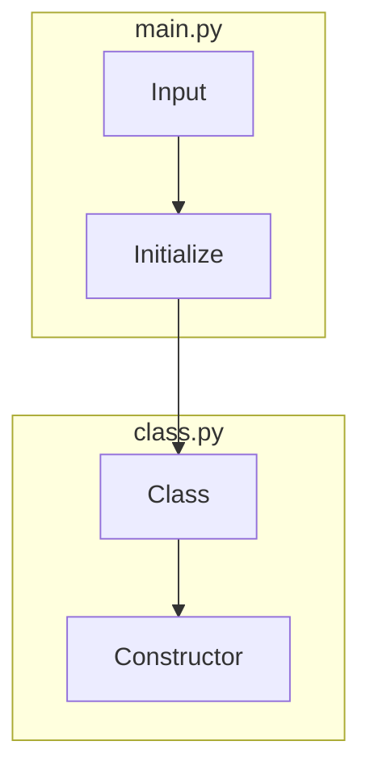
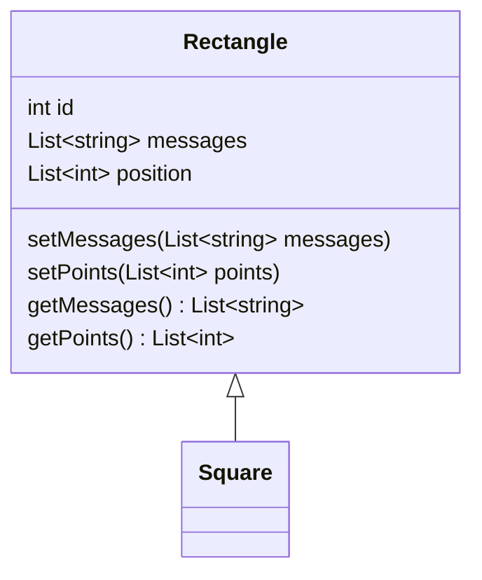

```mermaid

flowchart TB
    subgraph main.py
    Input-->Initialize
    end
    
    subgraph class.py
    Class-->Constructor
    end

    Initialize-->Class 
```    

```mermaid 
classDiagram
    Rectangle <|-- Square
    class Rectangle~Shape~{
    int id
    List~string~ messages
    List~int~ position
    setMessages(List~string~ messages)
    setPoints(List~int~ points)
    getMessages() List~string~
    getPoints() List~int~
    }
```